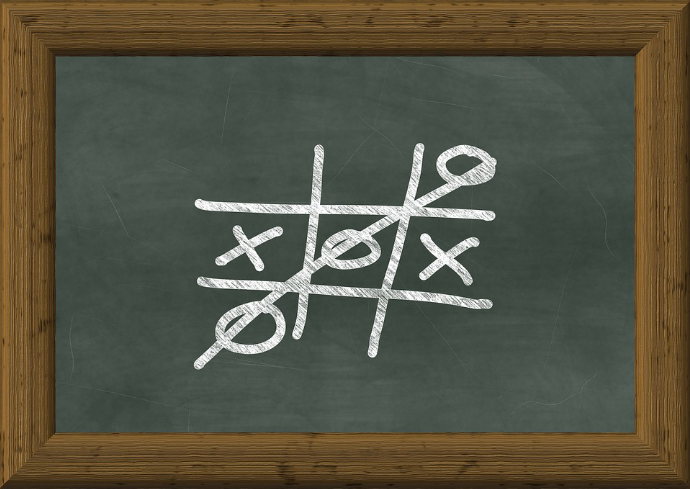

# AG002 - Engenharia de Computação e Software

## 1. Introdução

Neste semestre a AG002 acontecerá na forma de um trabalho prático. Você deverá utilizar seus conhecimentos para, a partir do conjunto de dados proposto, treinar, avaliar e disponibilizar um modelo de aprendizado de máquina para apontar o desfecho de uma partida de jogo da velha.

## 2. Conjunto de Dados

Jogo da velha é um jogo para duas pessoas que requer apenas lápis e papel. O tabuleiro é uma matriz de três linhas por três colunas. Cada jogador se reveza desenhando uma cruz ou um círculo em uma posição desta matriz. O vencedor é aquele que conseguir colocar três peças iguais em uma fileira, na vertical, na horizontal ou na diagonal (conforme ilustrado na figura).

Neste sentido, o conjunto de dados apresenta 958 amostras, que representam todos as possíveisde preencher o tabuleiro do jogo da velha. Cada amostra do conjunto é dada por:

- Nove atributos (enumerados de 1 a 9) que representam o estado de cada posição do tabuleiro; os possíveis valores são `x` (cruz), `b` (vazio) ou `o` (círculo).
- Um rótulo de classe, que representa o desfecho daquela configuração em particular; os possíveis valores são "positivo" (que indica a vitória do `x`) ou "negativo" (que indica empate ou derrota do `x`).

Neste trabalho será utilizada uma versão traduzida do conjunto originalmente concebido por Aha \[1] em 1991. Os dados originais foram obtidos do [UCI Machine Learning Repository](https://archive.ics.uci.edu/ml/datasets/Tic-Tac-Toe+Endgame).

## 3. Etapas para Realização

1. Baixar o [conjunto de dados](https://raw.githubusercontent.com/marcelovca90-inatel/AG002/main/tic-tac-toe.csv) em formato CSV (_comma-separated-values_).
2. Fazer a leitura dos dados utilizando a biblioteca [Pandas](https://www.machinelearningplus.com/pandas/pandas-read_csv-completed/).
3. Converter os valores presentes no conjunto de dados para números inteiros, de acordo comeste mapeamento: `o→−1`, `b→0`, `x→+1` , `negativo→−1` e `positivo→+1`. Dica: método [`replace`](https://pandas.pydata.org/docs/reference/api/pandas.DataFrame.replace.html), presente na classe DataFrame do Pandas.
4. Escolher um dos modelos de classificação a seguir:
   - Decision Tree: [Wikipedia](https://en.wikipedia.org/wiki/Decision_tree), [KDnuggets](https://www.kdnuggets.com/2020/01/decision-tree-algorithm-explained.html) e [scikit-learn](https://scikit-learn.org/stable/modules/generated/sklearn.tree.DecisionTreeClassifier.html).
   - k-Nearest Neighbors: [Wikipedia](https://en.wikipedia.org/wiki/K-nearest_neighbors_algorithm), [Towards Data Science](https://towardsdatascience.com/machine-learning-basics-with-the-k-nearest-neighbors-algorithm-6a6e71d01761) e [scikit-learn](https://scikit-learn.org/stable/modules/generated/sklearn.neighbors.KNeighborsClassifier.html).
   - Multilayer Perceptron: [Wikipedia](https://en.wikipedia.org/wiki/Multilayer_perceptron), [KDnuggets](https://www.kdnuggets.com/2016/11/quick-introduction-neural-networks.html) e [scikit-learn](https://scikit-learn.org/stable/modules/generated/sklearn.neural_network.MLPClassifier.html).
   - Naive Bayes: [Wikipedia](https://en.wikipedia.org/wiki/Naive_Bayes_classifier), [Towards Data Science](https://towardsdatascience.com/naive-bayes-classifier-explained-50f9723571ed) e [scikit-learn](https://scikit-learn.org/stable/modules/generated/sklearn.naive_bayes.GaussianNB.html).
   - Perceptron: [Wikipedia](https://en.wikipedia.org/wiki/Perceptron), [Towards Data Science](https://towardsdatascience.com/perceptron-learning-algorithm-d5db0deab975) e [scikit-learn](https://scikit-learn.org/stable/modules/generated/sklearn.linear_model.Perceptron.html).
5. [Separar](https://scikit-learn.org/stable/modules/generated/sklearn.model_selection.train_test_split.html) o conjunto de dados em duas partes: 80% para treinamento e 20% para testes.
   - Treinar o modelo escolhido usando 80% dos dados.
   - Avaliar o modelo escolhido usando os 20% restantes.
6. Exibir [métricas de avaliação](https://scikit-learn.org/stable/modules/model_evaluation.html#classification-metrics), para que possa ser verificada a acurácia do modelo.
7. Criar uma opção que permita ao usuário inserir dados arbitrários que devem ser classificados pelo modelo. O modelo deverá imprimir se, com base no conhecimento adquirido com os dados do conjunto, os dados inseridos constituem vitória de `x` ("sim" ou "não"). Dica: método [`predict`](https://scikit-learn.org/stable/modules/generated/sklearn.linear_model.Perceptron.html#sklearn.linear_model.Perceptron.predict), presente em todos os classificadores.

## 4. Orientações Adicionais

- O trabalho deverá ser feito em dupla;
- Qualquer linguagem de programação pode ser utilizada;
- A entrega deverá ser feita por meio de um arquivo zip com todo o conteúdo do projeto, ou o link de um repositório privado do GitHub;
- Para apresentação, o aluno deverá gravar um vídeo de no máximo 7min de duração, explicando em detalhes as etapas do projeto desenvolvido;
- O vídeo poderá ser feito gravando a própria tela do computador enquanto o aluno explica ou até mesmo ser usado o smartphone, desde que as explicações das etapas estejam nítidas;
- A entrega deve ser feita até o dia **26/06/2022**. Disponibilize vídeo e arquivo zip (se for usar) no OneDrive, com permissão de acesso para guilherme@inatel.br. Se usar GitHub (em vez de arquivo zip), disponibilize link também com permissão de acesso.

## 5. Referências

[1] David W Aha. _Tic-Tac-Toe Endgame database_. Ago. de 1991. URL: https://archive.ics.uci.edu/ml/datasets/Tic-Tac-Toe+Endgame.
